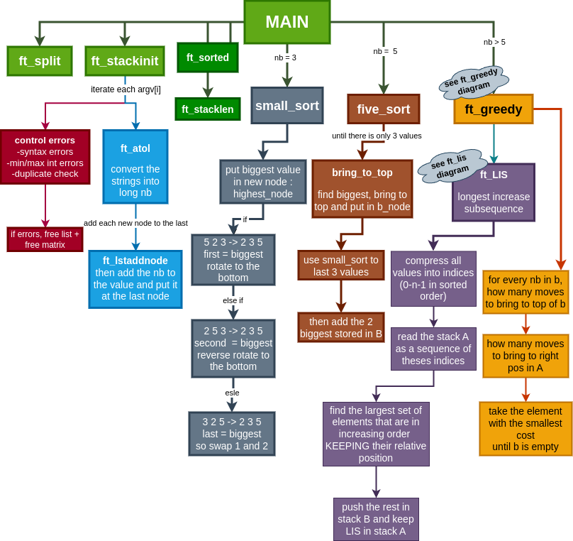
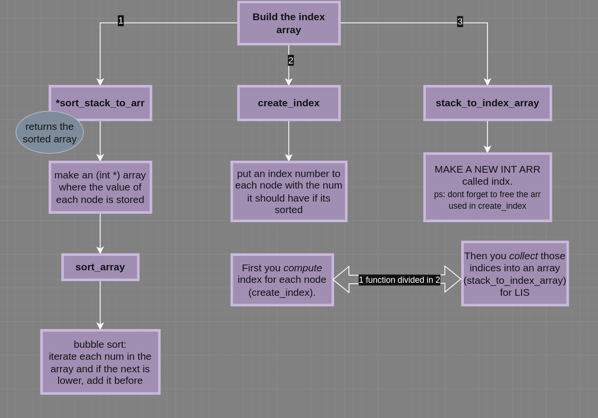
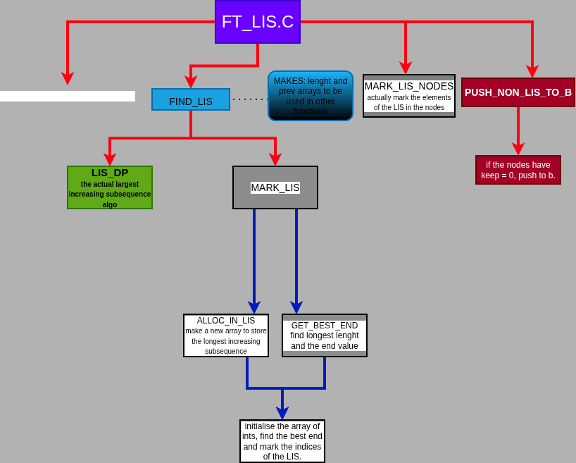
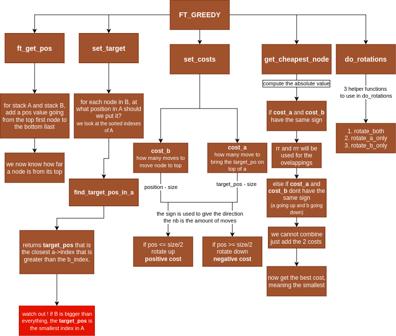

So this is the first project of 42 where you actually need to sit down and figure out what 
you want to do.
I made some diagrams and documentation to feel less lost.
so here is the general pipeline of my project:

for the difficult parts, I made some seperate diagrams to better understand them.

before starting anything about the sorting algos, you have to manage what the user can feed the program.
the subject and the checker makes us understand that we can input:
1. arrays of numbers : "23 21 54 12 98 8 100"
2. the numbers directly : 23 21 54 12 98 8 100
3. a mix of arrays and numbs : "1 2 34 119" 24 43 45 "12344"

Here is how I computed that:

insert algo

## Now, the real push_swap algo (for 5 nbs and +).

first of all, 

its recommended and, alot easier to work with the index of each value and not the value itself.
the index is the placement of the value if they were sorted.

why you may ask?

- having a dense and ordered range like [1,2,3,4] is alot safer and clearer than having this for example : [-2343, -54, 15, 274632]
Now, for comparing the placements, we are sure to have values of [0, n-1] !

here is a diagram that shows you how i computed that:

## ok, now the largest increasing subsequence is actually pretty hard to code.

It refers to the longest sequence of numbers that is strictly increasing. the numbers DO NOT have to be next to each other.

Example,

in -> 5 2 8 6 3 6 9 7, one of the LIS is -> 2 3 6 9 (length 4).

here is a diagram to better understand the coding part:

if you still dont understand, watch this video...
 https://www.youtube.com/watch?v=E6us4nmXTHs&t=546s 

After that, we will insert the values of stack B in stack A using the greedy insertion.
Meaning, what value should we insert that will be the cheapest (less moves).

Here is the logic:

Here is some reference for my project: 
https://medium.com/@dansylvain84/my-implementation-of-the-42-push-swap-project-2706fd8c2e9f
